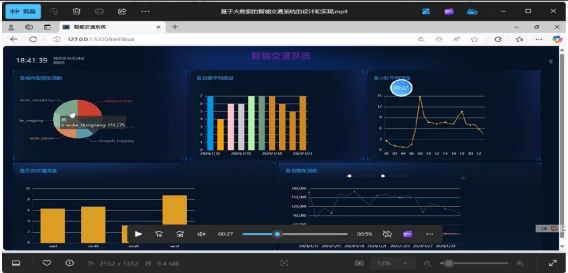
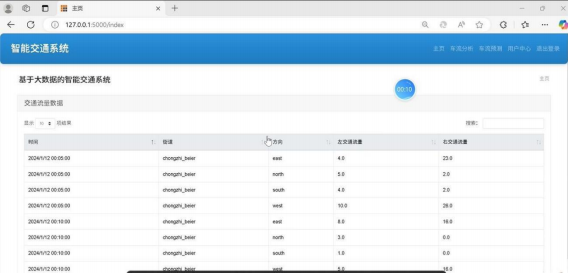
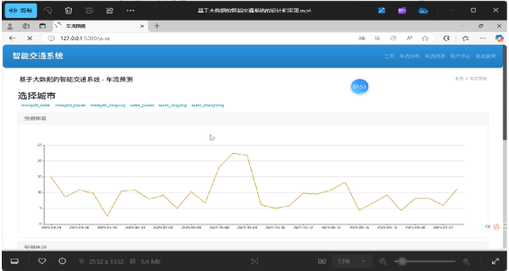
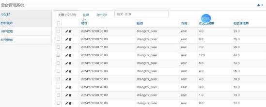
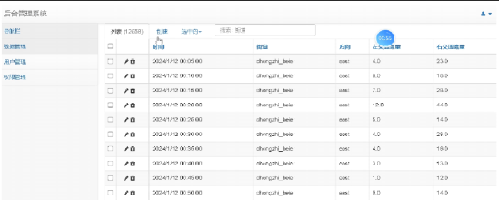
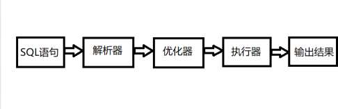
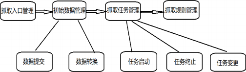
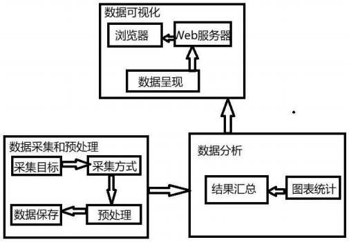

## 计算机毕业设计Hadoop+Spark交通流量预测 智慧城市交通大数据 交通客流量分析(源码+LW文档+PPT+讲解视频) 机器学习 大数据毕业设计 数据仓库 大数据毕业设计 文本分类 LSTM情感分析 大数据毕业设计 知识图谱 大数据毕业设计 预测系统 实时计算 离线计算 数据仓库 人工智能 神经网络

## 要求
### 源码有偿！一套(论文 PPT 源码+sql脚本+教程)

### 
### 加好友前帮忙start一下，并备注github有偿交通流量预测25
### 我的QQ号是3575354124 或者798059319或者 1679232425或者微信:bysj1698

# 

### 加qq好友说明（被部分 网友整得心力交瘁）：
    1.加好友务必按照格式备注
    2.避免浪费各自的时间！
    3.当“客服”不容易，repo 主是体面人，不爆粗，性格好，文明人。

## 演示视频

https://www.bilibili.com/video/BV1sMJTzfEcL/?spm_id_from=333.1387.homepage.video_card.click

## 介绍：
   摘  要

随着城市化进程持续向前推进，交通拥堵这一问题愈发严重起来。智能交通系统 （ITS），它可是解决城市交通难题的重要途径，因而受到了普遍的关注。本论文精心设 计并成功实现了一种依托大数据的智能交通系统，该系统把 Flask 、Vue 、SQLite  以及 ECharts  这些技术融合起来，具备交通数据爬取、交通数据可视化以及车流量预测等多 项功能。系统一开始会凭借爬虫技术去获取实时的交通数据，随后将这些数据存储到 SQLite  数据库当中，以此来为后续的分析给予数据方面的有力支撑。利用 ECharts  展 开数据的可视化展示操作，如此一来，用户便能够十分直观地查看在不同时间段、不同 区域的交通流量所发生的变化情况。通过车流量预测模型， 系统是能够对未来一段时间 内的交通流量做出预测的，进而为交通管理部门提供在决策方面的有效支持。经过实验 得出的结果清晰地表明，该系统确实能够在提升交通。
关键词：智能交通系统；Flask；ECharts

Abstract

As urbanization keeps advancing, the issue of traffic congestion is growing more and more severe. The intelligent transportation system (ITS), being an essential way to tackle the urban traffic problem, has drawn extensive attention. In this paper, an intelligent traffic system relying on big data has been designed and put into practice. This system brings together technologies like Flask, Vue, SQLite, and ECharts, and it possesses functions such as crawling traffic data, visualizing traffic data, and predicting traffic flow. Firstly, the system gets real-time traffic data by means of crawler technology and then stores this data in the SQLite database to offer data backing for subsequent analysis. ECharts is utilized for displaying data in a visual manner, enabling users to view the changes in traffic flow during different time periods and in different areas directly. Through the traffic flow prediction model, the system is capable of predicting the traffic flow within a certain period in the future, thus providing decision-making support for the traffic management department. The experimental results demonstrate that the system can enhance the efficiency of traffic data acquisition, the accuracy of prediction, and the user experience effectively. The research in this paper presents a workable design plan for the development of the intelligent transportation system and holds certain practical value.
Keywords: intelligent transportation system; Flask; ECharts

目    录

1  绪论	 1
1.1  研究背景及意义	 1
1.2  国内外研究现状	 1
1.3  论文结构	 1
2  相关技术分析	 3
2.1  线性回归算法	 3
2.2 SQLite 	 3
2.3 Flask 	 4
2.4 Echarts 	 4
3  需求分析	 6
3.1  可行性分析	 6
3.1.1  经济可行性	 6
3.1.2  技术可行性	 6
3.1.3  运行可行性	 6
3.1.4  时间可行性	 6
3.2  功能需求分析	 6
3.2.1  总体流程	 6
3.2.2  数据采集	 6
3.2.3  数据分析	 7
3.3  非功能需求分析	 7
4  系统设计	 10
4.1  总体设计	 10
4.2  数据采集	 10
4.3  数据分析	 12
4.4  数据表设计	 13
4.5  交通流量预测	 15

5  系统实现	 17
5.1  系统后台搭建	 17
5.1.1  开发环境与配置	 17
5.1.2  框架配置介绍	 17
5.2  用户功能模块	 19
5.2.1  登录	 19
5.2.2  首页界面	 19
5.2.3  交通流量分析	 20
5.2.4  交通车流预测	 21
5.3  管理员功能模块	 21
5.3.1  交通数据管理	 21
5.3.2  用户数据管理	 22
5.4  系统的测试	 23
5.4.1  测试目的	 23
5.4.2  测试用例	 23
5.5  本章小结	 24
6  总结与展望	 25
6.1  结论	 25
6.2  展望	 25
参考文献	 26
致  谢	 27

1  绪论

1.1  研究背景及意义
伴随都市化进程的深化，交通问题对城市可持续发展的负面影响日益凸显，行车拥 堵加剧、空气质量恶化及交通意外频发等现实困境，升级为现代城市运行的重大瓶颈， 现有交通管理体系面对愈发繁重的交通压力时效率低下，采用先进技术增强交通管理智 能化的途径，是现阶段必须应对的核心挑战。
大数据技术的迅猛发展为交通流量分析与预测创造了崭新契机，首先开展交通数据 的全面采集，随后开展数据挖掘，采用机器学习与数据挖掘相结合的算法，即可开展交 通流量的精准预测与系统分析，进而辅助交通管理部门的决策工作，实现城市交通效率 优化，依托大数据的交通流量预估，可实现对道路拥堵时段的车流数据进行智能预判， 增强信号灯调节和道路引导的合理性，实现道路交通量缩减，交通运行效率明显优化， 既能降低碳排量，又可改善城市的大气质量。
本研究具备显著意义，采用大数据框架进行智能交通系统的工程实践，可助力交通 管理实现智能化升级，系统以实时采集交通数据及流量分析预测为主要功能，整合了多 维数据可视化。
1.2  国内外研究现状
基于信息技术与大数据技术的长足进步，就交通流量的实时分析与预测而言，国内 外研究进展显著，该课题研究已取得明显突破，交通流量预测是智能交通系统（ITS）中 至关重要的核心模块，现阶段成为多国及地区推动交通管理升级、提高城市出行效能的 主要研究指向。
交通流运行分析与预测探讨，其学术探索开始时间较早，以欧美为代表的发达国家 优势明显，诸如美国、日本及部分欧洲国家，自 1990 年代起，这些地区就致力于开发 以大数据驱动、算法为核心的交通预测系统[1]，以美国为样本，基于 GPS 轨迹记录仪、 道路监测摄像头及智能传感节点，联动实时交通数据挖掘，进而构建了结合统计学原理 与机器学习模型的交通预测方法群。得益于深度学习与神经网络等技术的引入， 交通流 量预测在精度和响应速度方面均有显著优化[2]，尤其在预测城市车流量及高峰时段交通 调度规划时，此类数据驱动的实时预测系统正在诸多城市得到大规模部署，伦敦等全球

城市采用的智能交通调控体系，其技术架构已支持完整的流量预测及调度实施。
大数据及其关联技术（物联网、云计算） 发展态势迅猛，发展势头迅猛，依托这一 进程，近期交通流量预测研究取得明显成果[3]，实践层面显示，诸多城市陆续，开始应 用大数据赋能的智能化交通管理架构，国内学术圈聚焦的研究主题，重点集中在交通数 据采集、数据处理及交通预测模型构建三个维度， 依托经典回归方法和时序模型开展的 探讨，目前仍占据主流位置，伴随深度学习与支持向量机
采用支持向量机（SVM）等先进算法，国内学界针对精度的探索，也或是实时处理 维度，均得到较大改进[4]，尤其在京津冀、长三角等重点区域，交通流量预测系统的普 及程度正在稳步提升，部分城市结合多模态数据融合手段，成功实现了交通流量预测与 智能调度的双重目标。
从整体来看，国内国外皆，就交通流量分析预测而言，已达成较高水平的研究成就， 实际应用中存在诸多限制，数据兼具类型多样与结构复杂的特性，要协调处理速度与计 算精度的矛盾，以及模型输出可解释性等核心议题，此领域至今仍是研究者争相攻克的 热点，相关挑战依然存在[5]，实现大数据和 AI 算法的有机结合途径，以提高交通流量预 测的可靠性，提升其实用价值，这在今后探索中，长期属于研究热点[6]。
1.3  论文结构
全文采用六章结构布局，主要框架如下：
开章先明确城市交通现状中存在的主要矛盾，结合研究背景的考察，论述研究价值， 辅以国内外现有研究成果的对比分析，借此把握城市交通宏观格局，把握城市交通管理 中的核心问题与处置办法，随后就本研究采用的核心技术展开系统分析，数据处理的第 一步是预处理阶段，对存在大跨度、缺失或错误问题的数据进行清理， 接着开展数据筛 选阶段，筛选出研究适用的时间跨度与地理坐标范围。依托神经网络， 对数据属性及其 关联性进行挖掘，实现对数据的分类及回归预测分析，对数据库实施角色建模工作，划 分系统管理员及常规用户等角色层级，采用大屏数据可视化技术，以直观的图形方式反 映道路车流及其时间分布状况，在最终结论与后续展望段落，需针对研究过程中的主体 内容及其结论展开综合性总结，并对相关领域的后续研究进行前瞻。

2  相关技术分析

2.1  线性回归算法
该方法（线性回归）属于统计学范畴，其可分析变量间存在的线性相关性，且能预 测此类变量关系，该方法属于回归分析中最基础实用的技术范畴，用于揭示因变量（响 应变量）与自变量（解释变量）之间的预测性联系。
基于线性回归的实证分析中，实验结果表明，因变量（也就是 Y）和自变量（也就 是 X）呈线性依存关系，可采用以下公式呈现：
The equation can be expressed as Y being equal to β0 plus β1 times X1 plus β2 times X2 and so on until βn times Xn, with an additional term ε included.
其中：
Y 作为待预测项，属于因变量范畴；
自变量 Xn  与因变量之间存在关联；β0 作为截距参数，代表回归的基准值；
两个回归系数 β₁、β₂, 直至 βn 的回归系数，本质上对应的是自变量的回归系数，从 另一角度讲，即变量所占的权重比例。
ε 为模型误差项，表示回归分析中未被自变量说明的波动。
线性回归试图找到拟合效果最佳的直线，从而令预测数据同实际测量值，将预测结 果与真实数据间的偏差降至最低，主要借助最小二乘法对模型系数做出估计，采用使残 差平方和最小化的策略进行数据拟合。
采用线性回归时，常规采用的测评参数有：
R 平方（R-squared）显示模型对数据波动性的阐释强度，该系数取值在[0,1]范围内， 当数值逼近 1 时，反映模型对数据的解释力越强。
均方误差（Mean Squared Error）度量，其计算的是预测值与真实值之间平方差的平 均值，作为衡量预测模型精度的指标。
线性回归适用于以下情况：
二者之间存在线性依存关系；
不同数据间的误差独立分布且同方差；预测变量间几乎不产生共线性干扰。
这种建模技术——线性回归，既简单又有效，可实现对变量的预测及其线性关联分 析，应用实施阶段，诸如股价、销量和房价等连续变量的预测问题， 常采用线性回归方

法进行分析。

2.2 SQLite
该关系型数据库管理系统 SQLite 采用轻量化设计，其核心代码采用 C 语言开发， 其架构呈现诸多典型特点，可实现嵌入式功能拓展，无需额外配置，且支持多平台的高 效部署，作为零服务器依赖的轻量级数据库，各类应用程序均可直接集成 SQLite，摆脱 了对独立数据库服务器的依赖。数据库引擎与应用层在此达成深度绑定， 所有数据存储 及处理相关流程，所有流程均依托本地资源展开，因此特别适合移动终端、PC  软件及 嵌入式设备等多种应用环境，适配效果显著[7] ，SQLite  采用独立文件作为数据库载体， 具备自支撑的属性，从而有效降低了数据备份、迁移及共享等工作的复杂度。从功能支 持维度看，SQLite 呈现出更紧凑的实现方式，不过该引擎仍完整实现了 SQL 的核心语 法，内建事务协议、多表联查、索引优化器及触发器逻辑等标准实现方案， 基本满足各 类中小型应用的数据存储要求，凭借低耗高效的运行机制及紧凑架构，SQLite 在移动应 用、浏览器及物联网等领域的应用十分普及[8]。

